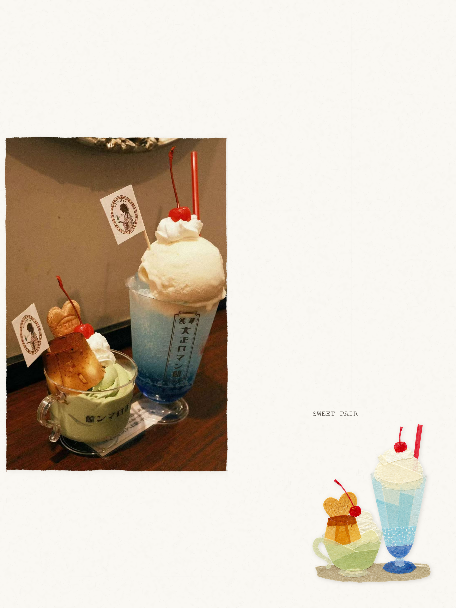
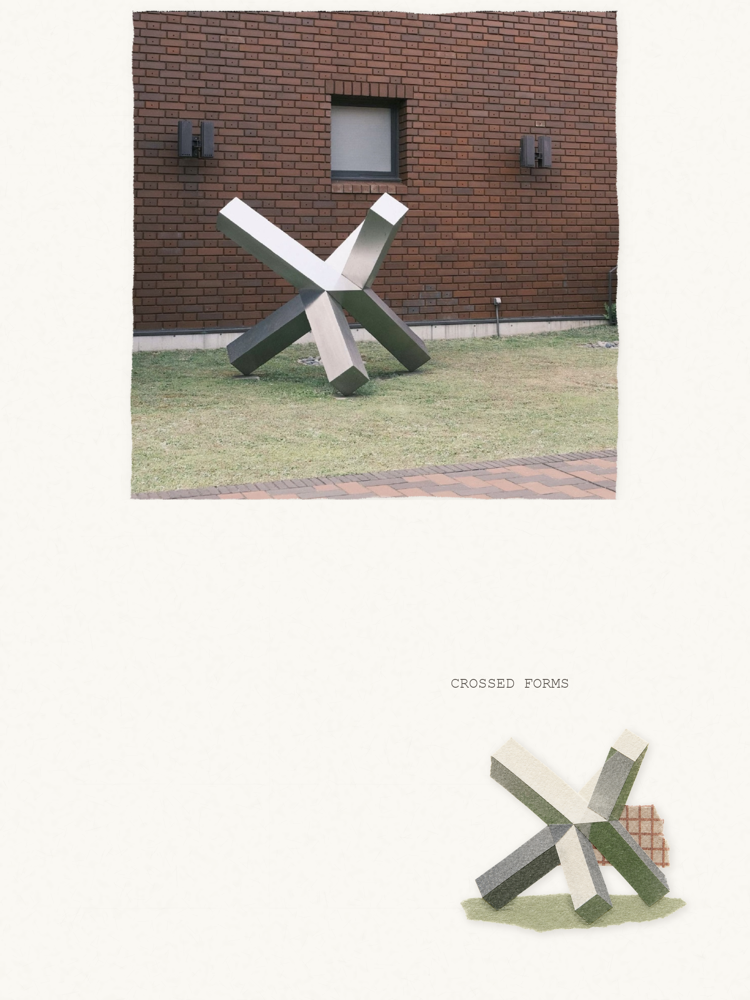
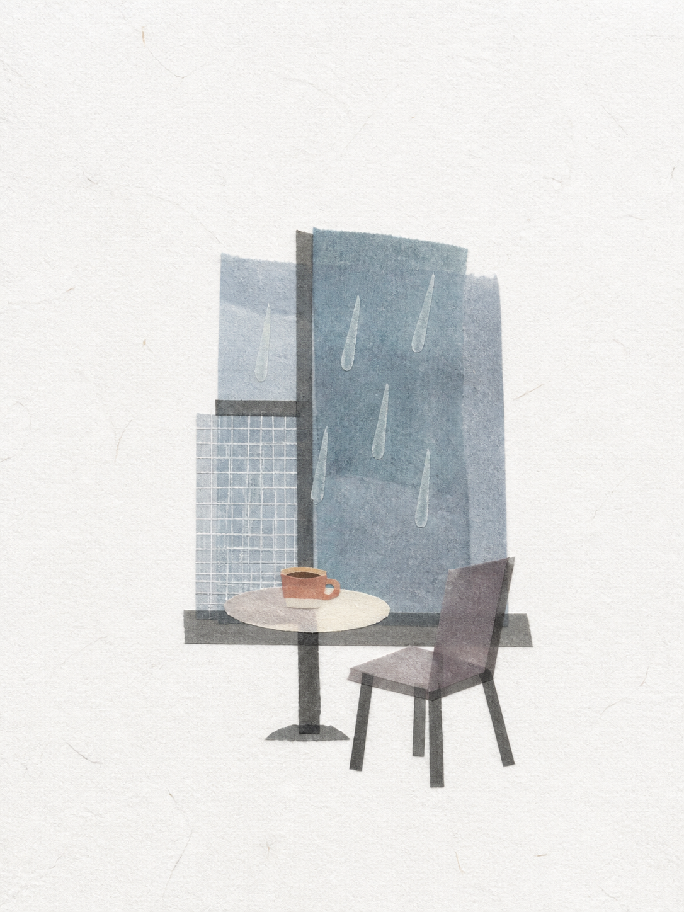
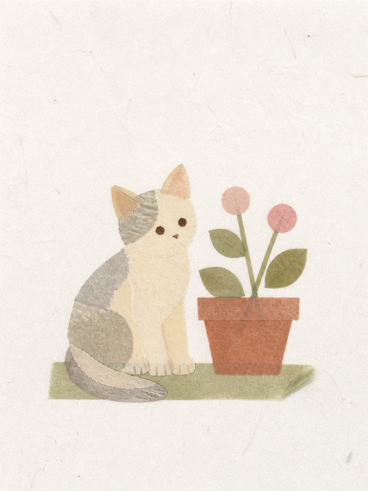

# Make Tape Collage

[简体中文](README.zh-CN.md) | **English**

Turn a photograph or short description into a clean, tactile washi-tape collage. The skill can also preserve an original photograph unchanged and pair it with a compact tape-built interpretation on one continuous warm-white journal-paper sheet.


## Highlights

- Rebuilds food, pets, objects, plants, people, travel scenes, architecture, and moods from coherent tape planes.
- Uses broad and medium pieces, simple colors or familiar tape patterns, translucent overlaps, fibrous edges, and shallow contact shadows.
- Keeps compositions spacious and editorial instead of filling the page with scrapbook decoration.
- Supports faithful photo preservation: no redraw, recoloring, retouching, stretching, or generative replacement of retained photo pixels.
- Produces one continuous clean warm-white paper surface with visible irregular fibers, subtle pulp relief, and faint discontinuous scan traces.
- Uses deterministic local composition for layout, paper, photo mounting, shadows, and typography, avoiding generated paper seams or mismatched backgrounds.
- Excludes tickets, receipts, labels, stamps, seals, pseudo-writing, visible tools, and unrelated vintage ephemera unless explicitly requested.

## Examples

| Preserved photo · SWEET PAIR | Preserved photo · CROSSED FORMS |
| --- | --- |
|  |  |
| **From a description · Rainy window** | **Photo transformation · Cat and pot** |
|  |  |

The first two use preserved-photo mode: the untouched photograph sits beside a warm-white paper panel carrying a compact tape-built interpretation and a faded typewriter title. The last two are tape-only collages: the source photo never enters the artwork and the subject is rebuilt entirely from tape.

## Usage

Invoke the skill explicitly with `$make-tape-collage`, or describe a request that clearly asks for a washi-tape or masking-tape collage.

### Transform a photo

```text
Use $make-tape-collage to turn this cat photo into a washi-tape journal collage.
```

```text
Use $make-tape-collage to transform this building photo into a quiet tape-built poster. No text.
```

The subject is reconstructed from tape; the source photograph does not appear in the final artwork unless you request that it be preserved.

### Preserve the original photo

```text
Use $make-tape-collage to turn this photo into a tape-collage journal page and preserve the original photo.
```

```text
Use $make-tape-collage to preserve this photo and place the title "TOKYO" beside the tape motif.
```

This mode keeps the photo and the tape interpretation in separate layout zones. It generates only a transparent tape motif, then assembles the final image locally so the source pixels and paper texture remain controlled.

### Generate from a description

```text
Use $make-tape-collage to create a blue-gray tape-collage poster about solitude on a rainy day.
```

```text
Use $make-tape-collage to create a warm tape-collage poster about being alone in a café.
```

Description-only work is text-free by default.

### Request precise changes

```text
Keep the approved collage unchanged, but make the title larger and move the motif to the lower-left corner.
```

```text
Keep the photo pixels and layout unchanged. Increase only the visible paper-fiber texture.
```

## Default behavior

| Property | Default |
| --- | --- |
| Final format | `3:4` portrait (`width:height`) for image-based work |
| Photo transformation | One recognizable subject built from about 10–18 coherent tape pieces, with up to two quiet source-derived environmental echoes when useful |
| Preserved portrait photo | Photo at left, paper panel at right |
| Preserved landscape or square photo | Photo above, paper panel below |
| Preserved-photo split | Approximately 50% photograph and 50% paper |
| Photo integrity | Unchanged retained pixels; no redraw, recoloring, retouching, stretching, or texture overlay |
| Photo cropping | At most 20% of source area, only when necessary; use no crop when subject integrity benefits |
| Photo mounting | Borderless print, natural torn exposed edges, restrained ambient and contact shadows |
| Preserved-mode motif | Compact motif-and-caption group in a balancing corner, about 20% of the paper panel |
| Paper | Clean warm white, visibly fibrous, low contrast, non-repeating, and free of stains or heavy aging |
| Image-based text | One factual English title of one to three words unless exact text or no text is requested |
| Description-only text | None |
| Generation passes | One motif-generation call by default; at most one targeted revision for failed recognition or tape material |

Explicit user instructions override these defaults.

## Visual system

The preferred style is a **soft structural scene distillation**:

- Preserve one to three identification anchors.
- Translate perspective or volume into adjacent light, middle, and dark tape planes rather than drawn outlines.
- Keep the collage flat and front-facing, with shallow overlap depth rather than sculptural paper volume.
- Use a source-derived low-saturation palette of roughly four to six colors, with at most one restrained warm accent.
- Favor solid tape and simple patterns such as stripes, checks, grids, or dots.
- Keep obvious wrinkles below about 25% of the motif region.
- Preserve generous negative space and a clear inset from every paper edge.

The bundled reference images guide material, abstraction, and composition only. Their depicted subjects must never be copied.

## How preserved-photo composition works

1. `compose_direct_split.py --plan` resolves the final ratio, panel orientation, crop limits, and pixel geometry.
2. Image generation creates one isolated, text-free tape motif on transparent RGBA.
3. The compositor synthesizes one continuous journal-paper surface for the entire canvas.
4. Original photo pixels are mounted without pixel-level filtering.
5. Torn-edge masks, restrained shadows, motif placement, and exact typography are added deterministically.
6. The result is checked for aspect ratio, crop fraction, source-pixel integrity, transparency, paper continuity, and safe margins.

This split workflow prevents generated white rectangles, checkerboards, stains, and color casts from leaking into the paper panel.

## Manual compositor use

The compositor is mainly used by the skill, but it can also be run directly with Python and Pillow.

Preview the resolved layout:

```bash
python scripts/compose_direct_split.py \
  --photo path/to/photo.png \
  --crop-mode none \
  --plan
```

Assemble a preserved-photo composition from a transparent motif:

```bash
python scripts/compose_direct_split.py \
  --photo path/to/photo.png \
  --motif path/to/motif-rgba.png \
  --output path/to/final.png \
  --crop-mode none \
  --caption "QUIET MORNING"
```

Run `python scripts/compose_direct_split.py --help` for layout, aspect, crop, motif, paper, shadow, and typography options. The legacy `--paper-panel` path is retained for older assets; new work should use `--motif`.

## Installation

```bash
git clone https://github.com/sherlyryn/make-tape-collage.git
mkdir -p "${CODEX_HOME:-$HOME/.codex}/skills"
cp -R make-tape-collage \
  "${CODEX_HOME:-$HOME/.codex}/skills/make-tape-collage"
```

Alternatively, download this repository and place the complete folder at `$CODEX_HOME/skills/make-tape-collage/`. On a default Windows installation this is commonly:

```text
%USERPROFILE%\.codex\skills\make-tape-collage\
```

If the skill does not appear immediately, reload Codex so the skill catalog can discover it, then invoke it with `$make-tape-collage` or a matching natural-language request.

Built-in image generation is used by default. Running the compositor manually requires Python and Pillow.

## Project structure

```text
make-tape-collage/
|-- SKILL.md
|-- README.md
|-- README.zh-CN.md
|-- LICENSE
|-- agents/
|   `-- openai.yaml
|-- assets/
|   |-- style-references/
|   `-- examples/
|-- references/
|   |-- prompt-recipes.md
|   `-- style-system.md
`-- scripts/
    `-- compose_direct_split.py
```

## Customization

- Edit [`references/style-system.md`](references/style-system.md) to adjust the visual language, scale, palette, paper, exclusions, and preserved-photo rules.
- Edit [`references/prompt-recipes.md`](references/prompt-recipes.md) to refine generation templates and examples.
- Update [`scripts/compose_direct_split.py`](scripts/compose_direct_split.py) for deterministic geometry, photo mounting, paper synthesis, shadows, and typography.
- Add curated images under [`assets/style-references/`](assets/style-references/) and document their exact role in the style system. Treat references as evidence for style, never reusable subject templates.
- Keep [`SKILL.md`](SKILL.md) focused on routing, essential workflow, and non-negotiable invariants.

After modifying the skill, validate it with the bundled Skill Creator validator:

```bash
python path/to/skill-creator/scripts/quick_validate.py path/to/make-tape-collage
```

## Known boundaries

- Face identity is not preserved in tape-only transformations.
- Complex scenes are intentionally simplified to a few anchors and supporting echoes.
- Exact text is added deterministically in preserved-photo mode; generated freeform lettering is avoided.
- Source-photo preservation applies only when the request explicitly asks to keep or show the original photograph.
